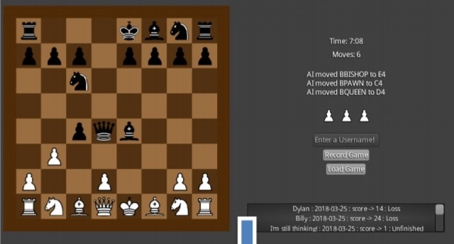

## ♖♘♗♕♔ Chess AI ♛♚♝♞♜
A Java chess engine and AI using the MiniMax algorithm and the LibGDX framework.

I wrote this a while ago, so the dependencies are probably all out of date, and I haven't run it in years. But feel free to rebuild the project and have a play. It uses an enhanced form of the Minimax algorithm to evaluate the best move. That's done through board evaluation using relative piece values and square tables. There is also a configurable search depth for the search tree, but I couldn't win if it was set any higher than 3.

Also, you'll have to boot up a MySQL instance and tinker with the configurations inside the `DBConnection#initialize` method.

You can read my blog post about implementing the Minimax algorithm with alpha beta pruning in the context of a chess AI [here](https://thenullproject.com/page.html?fetchpost=3). If you're keen enough, the blog post also has a link to my old design document for this project that you can read through.